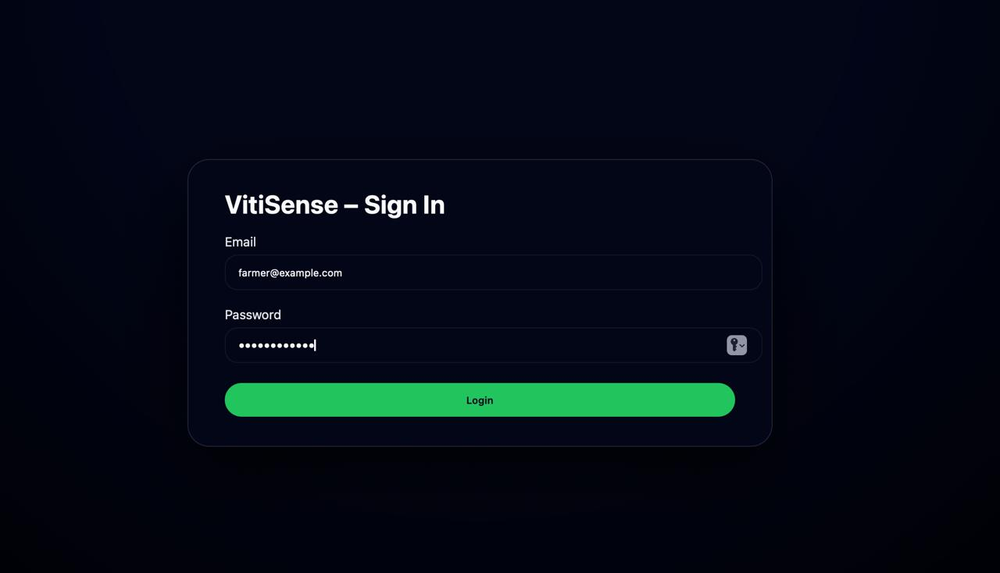
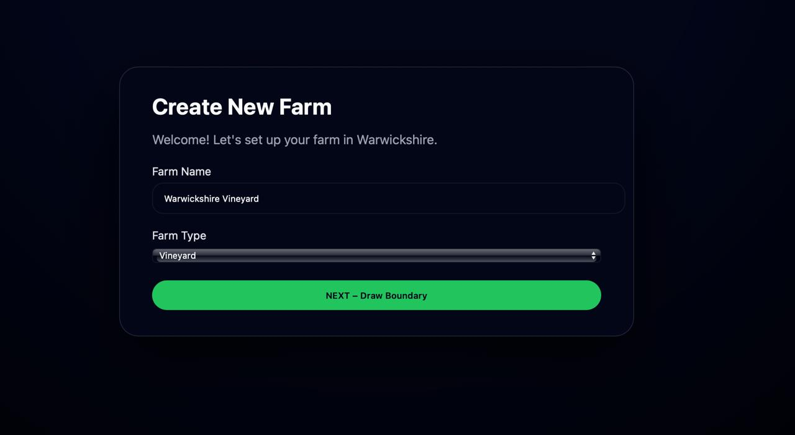
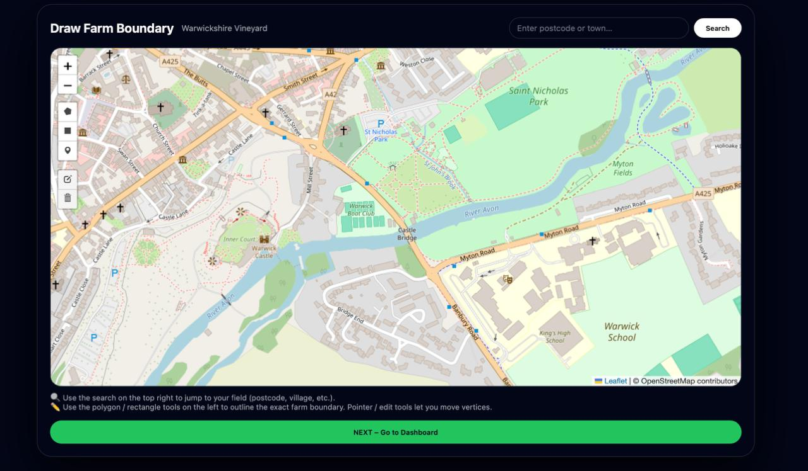
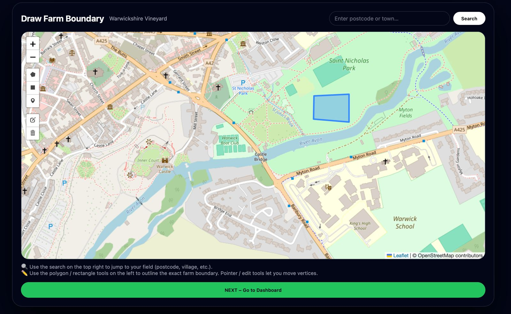
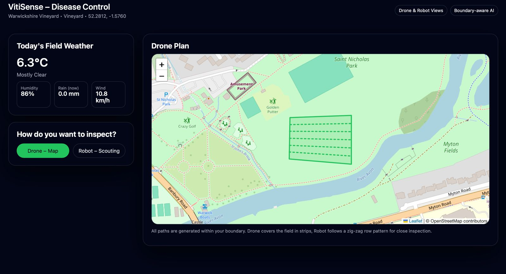
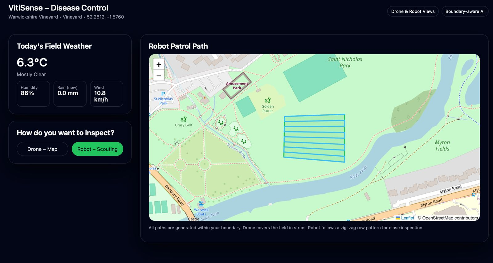
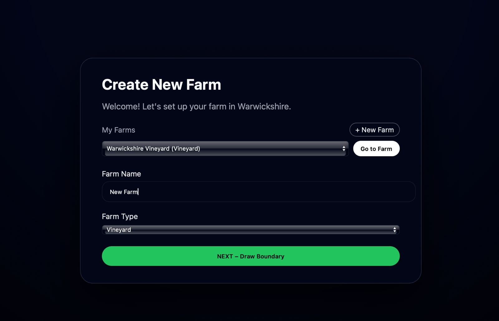

 # 🍇 Viti-Sense  
### Smart Vineyard Disease Monitoring & Autonomous Field Insights  
_A DroneWorx.ai project_

Viti-Sense is an intelligent field-management dashboard designed for vineyards.  
It combines **drone aerial imaging**, **robot row-based inspection**, and **real-time weather intelligence** to help farmers detect diseases early and plan optimal field operations.

This project includes:

- A fully interactive **farm setup wizard**
- Polygon-based **boundary drawing**
- **Drone grid coverage** visualization inside the farm
- **Robot zig-zag row inspection** inside the same boundary
- Live **weather and humidity** panels
- Clean, modern **dark-theme UI** built with React + Vite
- Local persistence of multiple farms (via `localStorage`)

---

## 🚀 Features

### 🌱 Create & Manage Farms
- Add new vineyards via a guided form  
- Save multiple farms locally  
- “Go to Farm” shortcut loads previous boundaries & settings  

### 🗺 Draw Farm Boundaries  
Powered by **Leaflet + Geoman**  
- Search by postcode / location  
- Draw, edit, or remove boundaries  
- Snap the map to your farm automatically  

### 🤖 Drone & Robot Field Inspection
- **Drone Mode:** Generates an aerial grid path  
- **Robot Mode:** Generates a zig-zag row-based path  
- All paths stay inside the farmer’s boundary  

### 🌤 Weather Intelligence  
- Temperature  
- Rain chance  
- Humidity  
- Wind  
  
---

## 🖼 Screenshots

Below are preview screens from the Viti-Sense dashboard.

---

### 🔐 Login  


### 🧭 Create Farm  


### ✏️ Draw Boundary  


### 🛠️ Boundary Tools  


### 🚁 Drone Map 


### 🤖 Robot Scouting  


### 📊 Create Farm Overview  



## 🏗 Tech Stack

| Layer | Technology |
|-------|------------|
| Frontend | React + Vite |
| Mapping | Leaflet, Leaflet-Geoman |
| UI | Custom Tailwind-style dark theme |
| State | React Hooks + localStorage |
| Build | Vite |
| Deployment | (Optional) Netlify / Vercel |

---

## 📦 Installation

```bash
git clone https://github.com/Droneworxai/Viti-Sense.git
cd Viti-Sense
npm install
npm run dev
```

After starting the development server, access the dashboard at:

➡️ http://localhost:5173

```
🗂️ Project Structure

Viti-Sense/
│── public/
│── src/
│   ├── pages/
│   │   ├── LoginPage.jsx
│   │   ├── CreateFarmPage.jsx
│   │   ├── BoundaryPage.jsx
│   │   └── DashboardPage.jsx
│   ├── utils/
│   │   └── geo.js
│   ├── App.jsx
│   └── main.jsx
│── .gitignore
│── package.json
│── vite.config.js
└── README.md

```

```
🤝 Contributing

Pull requests are welcome!
To discuss new features or collaborations, open an Issue or contact the team.

```
```
🏢 About DroneWorx.ai

DroneWorx.ai builds cutting-edge autonomous and AI technologies
for agriculture, surveying, and field robotics.
Our mission: make farming smarter, faster, and disease-free.

```
```
📜 License

MIT License © 2025 DroneWorx.ai

```


